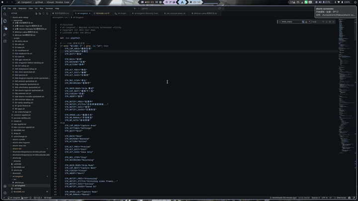
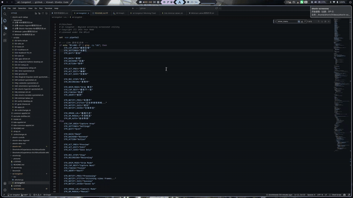

# wl-longshot

## [中文版](README-CN.md) | [ENGLISH](README.md)

A simple scrolling screenshot tool for Wayland Compositors. 

## Features

Smart Stitching: Uses Canny edge detection and Sobel gradients (OpenCV). It ignores transparent backgrounds and accurately stitches dense text without duplicating content.

Three Backends:

- `grim`: For tricky pages. Capture piece by piece. Stitching happens in a background worker. You can capture frames as fast as you want without waiting for stitching.

    

    It alse includes an "Auto" mode where you only draw the region once, and it will captures the same geometry on subsequent scrolls. 

    

- `wl-screenrec`: Stream recording. Just select an area, scroll your mouse, and hit stop.

    

- `wf-recorder`: Fallback video backend for better compatibility, as same as `wl-screenrec`

- UI Fallback

    Uses wofi, fuzzel, or rofi for the menu. If none are installed or if run directly in a terminal, it gracefully falls back to a CLI text menu.


## Installation

- Arch Linux

    ```
    yay -S wl-longshot-git
    ```

    Then you can `wl-longshot` command to open the menu.

## Dependencies

- `bash` 
- `slurp` (for selecting areas)
- `wl-clipboard` (for copying to clipboard)
- `python`, `python-opencv`, `python-numpy` (for the stitching engine)
- `satty`(for editing image)
- `xdg-utils`(for previewing image through `xdg-open`)
- `wl-screenrec` or `wf-recorder` (for stream recording)

