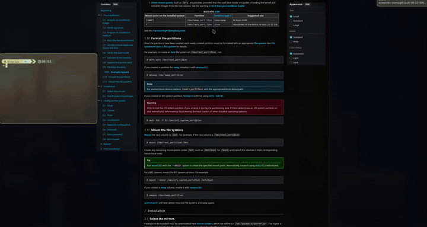

# wl-longshot

A scrolling screenshot tool for Wayland compositors.



## Installation

- Arch Linux

    ```
    yay -S wl-longshot-git
    ```

## Thanks

- [snemc](https://github.com/jswysnemc): Provided the inspiration for the screen recording-based scrolling screenshot implementation.
- [SHORiN-KiWATA](https://github.com/SHORiN-KiWATA): Designed the specific implementation methods and features.
- [Google Gemini](https://gemini.google.com/): Completed the main logic and core code.